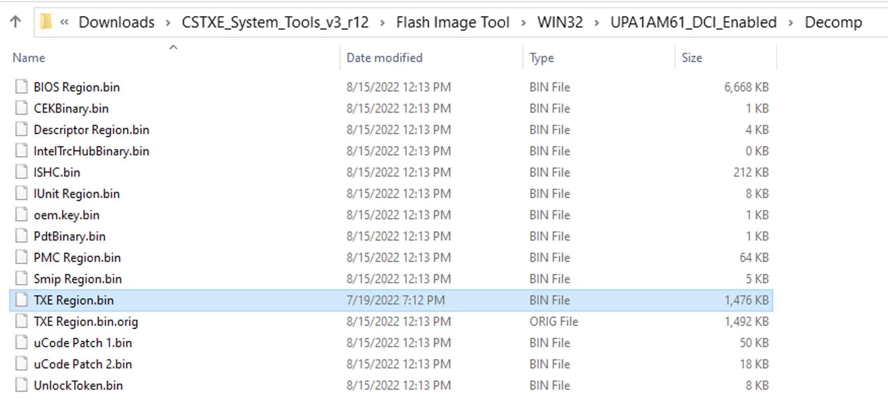
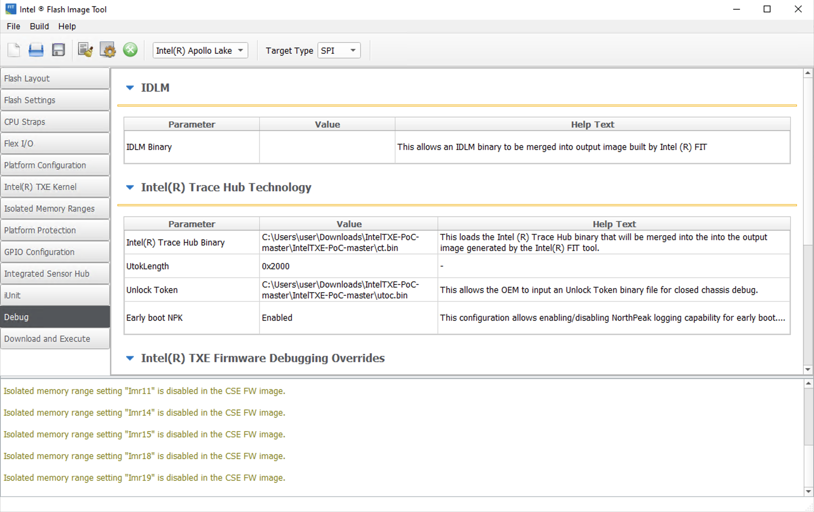
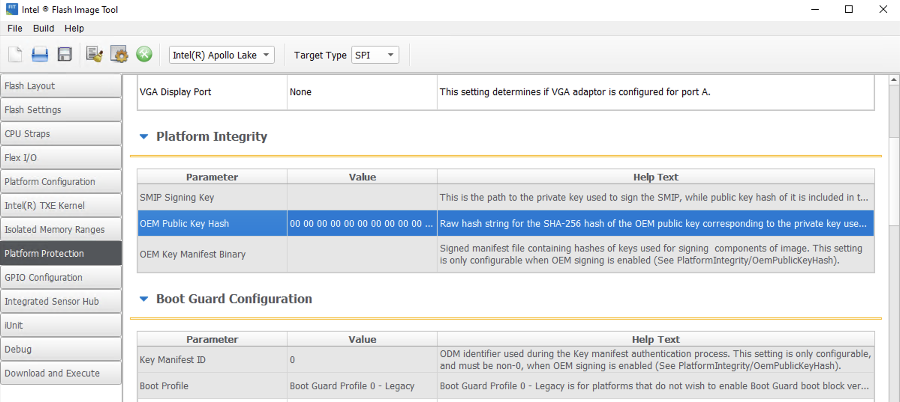
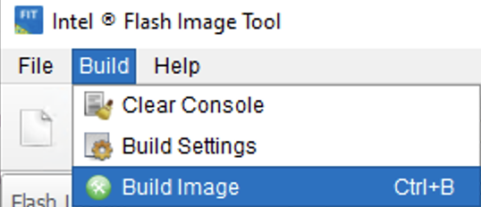
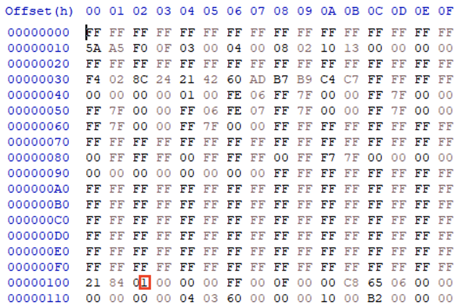

# **Disclaimer**

**All information is provided for educational purposes only. Follow these instructions at your own risk. Neither the authors nor their employer are responsible for any direct or consequential damage or loss arising from any person or organization acting or failing to act on the basis of information contained in this page.**

# Content
[Introduction](#introduction)  
[Required Software](#required-software)  
[Generating the Payload](#generating-the-payload)  
[Generating the Unlock Token](#generating-the-unlock-token)  
[Preparing the SPI Flash Image](#preparing-the-spi-flash-image)  
[Integrating Files Into the Firmware Image](#integrating-files-into-the-firmware-image)  
[Disabling OEM Signing](#disabling-oem-signing)  
[Building the Firmware Image](#building-the-firmware-image)  
[BringUP Main CPU](#bringup-main-cpu)  
[Writing the Image to SPI Flash](#writing-the-image-to-spi-flash)  
[Preparing the USB Debug Cable](#preparing-the-usb-debug-cable)  
[Patching OpenIPC Configuration Files](#patching-openipc-configuration-files)  
[Decrypting OpenIPC Configuration Files](#decrypting-openipc-configuration-files)  
[Adding LMT Core to the Configuration](#adding-lmt-core-to-the-configuration)  
[Setting the IPC_PATH Environment Variable](#setting-the-ipc_path-environment-variable)  
[Performing an Initial Check of JTAG Operability](#performing-an-initial-check-of-jtag-operability)  
[Show CPU ME Thread](#show-cpu-me-thread)  
[Halting Cores](#halting-cores)  
[ME Debugging: Quick Start](#me-debugging-quick-start)  
[Reading Arbitrary Memory](#reading-arbitrary-memory)  
[Reading ROM](#reading-rom)  
[Why TXE?](#why-txe)  
[Tested Platforms List](#tested-platforms-list)  
[Authors](#authors)  
[License](#license)


# Introduction
Vulnerability [INTEL-SA-00086](https://www.intel.com/content/www/us/en/security-center/advisory/intel-sa-00086.html) allows to activate [JTAG](https://en.wikipedia.org/wiki/JTAG) for [Intel Management Engine](https://en.wikipedia.org/wiki/Intel_Management_Engine) core. We developed our [JTAG PoC][8] for the [Gigabyte Brix GP-BPCE-3350C](https://www.gigabyte.com/ru/Mini-PcBarebone/GB-BPCE-3350C-rev-10) platform. Although we recommend that would-be researchers use the same platform, other manufacturers' platforms with the [Intel Apollo Lake](https://www.intel.com/content/www/us/en/embedded/products/apollo-lake/overview.html) chipset should support the PoC as well (for TXE version  **3.0.1.1107**). 

Because the Gigabyte Brix GP-BPCE-3350C is no longer widely commercially available, these instructions have been updated to instead target the AAEON UP Squared ***[SKU UPS-APLX7-A20-0864](https://up-shop.org/up-squared-series.html)*** (Intel Atom® x7-E3950). (They may also work with the cheaper Apollo Lake based SKUs, but those have not been tested yet.) If you purchase this board, make sure to also get the power supply, [serial adapter](https://up-shop.org/usb-2-0-pin-header-cable.html), and any [USB-to-serial](https://amzn.to/3bP9Zat) adapter.

# Required Software 

## Intel System Tools

Vulnerability *INTEL-SA-00086* involves a buffer overflow when handling a file stored on MFS (the [internal ME file system][6]). The full file path is */home/bup/ct*. You will need to integrate a vulnerability-exploiting version of this file into the ME firmware by using *Intel Flash Image Tool (FIT)*, one of the Intel System Tools provided by Intel to OEMs of hardware based on Intel PCH chipsets.

The Intel ME (TXE, SPS) System Tools utilities are not intended for end users—so you cannot find them on the official Intel website. However, some OEMs publish them as part of software updates together with device drivers. So, for integrating our PoC you need "CSTXE System Tools v3", which can be found [here](https://winraid.level1techs.com/t/intel-converged-security-trusted-execution-engine-drivers-firmware-and-tools/30730).

## Intel System Studio
You need to install Intel System Studio for performing JTAG debugging. In our original experiments, we used *Intel System Studio 2018*. These instructions have been updated for **Intel System Studio 2020** which can be obtained from [here](https://drive.google.com/file/d/15D6KQuC_WoTrxm_4ZUPmGYzrIIv9uQAS/view?usp=sharing).

## Intel TXE Firmware 
The PoC targets **Intel TXE firmware version 3.0.1.1107**. The "CSTXE 3.0" image repository at [Win-Raid forums](https://winraid.level1techs.com/t/intel-cs-me-cs-txe-cs-sps-gsc-pmc-pchc-phy-orom-firmware-repositories/30869) contains the necessary TXE firmware version.

## Python 
All our scripts are written on Python. We recommend using [Python 2.7](https://www.python.org/download/releases/2.7/)
Also the scripts require [pycrypto](https://pypi.org/project/pycrypto/) packet. To install *pycrypto*, run the following command:
```
pip install pycrypto
```

## AMIBCP

**This utility is only necessary if you need to bring up CPU.**

EFI Human Interface Infrastructure (HII) is a special mechanism for creating a user interface in the UEFI, as well as processing and managing user input. EFI HII identifies default values for all options, including the hidden ones. As soon as the option related to DCI is found, it can be activated for the default configuration, and DCI can be enabled by restoring the BIOS factory settings. For bringing up the main CPU you need *AMI BIOS Configuration Program* version 5.xx, which can be also found online. 


# Generating the Payload
Run the script **me_exp_bxtp.py**:
```
me_exp_bxtp.py -f <file_name>
```
The script generates the necessary data and exports it to the specified file (indicate either the full file path or, within the current directory, simply a name, *ct.bin* by default). This file will be used later by *FIT*.

# Generating the Unlock Token
Run the script **me_utok_bxtp.py**:
```
me_utok_bxtp.py -f <file_name>
```
The script generates the necessary data and exports it to the specified file (indicate either the full file path or, within the current directory, simply a name, *utok.bin* by default). This file will be used later by *FIT*.

# Preparing the SPI Flash Image

## Activating DCI option

**Skip this step if you don't need to bring up the CPU.**

To activate the *DCI Enable* option, run the AMIBCP utility and use it to open the SPI firmware image provided with your platform. For the Gigabyte Brix GP-BPCE-3350C, open the file downloaded from the Gigabyte link indicated above (path to image file in the archive: F5/image.bin).


Now we need to enable the *HDCIEN* option in the *Setup Configuration* tab.


## Integrate payload

To integrate *ct.bin* and *utok.bin* files, run the *FIT* utility (*fit.exe*) and use it to open the SPI firmware image.


# Other Hardware Platform

If you are using an other hardware platform and don't have access to *TXE 3.0.1.1107*, you can download the "CSTXE 3.0" image repository at [Win-Raid forums](https://winraid.level1techs.com/t/intel-cs-me-cs-txe-cs-sps-gsc-pmc-pchc-phy-orom-firmware-repositories/30869) and extract the TXE section through *FIT*. *FIT* extracts different sections of the overall SPI image (SPI descriptor, UEFI/BIOS firmware, Intel ME firmware, and Unlock Token) when the image is opened and saves them in the folder *"image_name"/Decomp *.



So you can find the file with necessary Intel TXE firmware at <image name>/Decomp/TXE Region.bin
Then, in *FIT*, open the SPI image for your particular platform. This will decompose your image and save the decomposed pieces to a folder in the same directory as fit.exe. After doing this, save the configuration XML and exit fit.exe. Now replace the "TXE Section.bin" file in the folder of your decomposed target BIOS with the version obtained from a decomposed TXE 3.0.1.1107 image. Re-open fit.exe and re-load your configuration from your saved XML file. If you replaced the file on the filesystem correctly, in the "Intel(R) TXE Binary File" on the Flash Layout tab you should see the version displayed as 3.0.1.1107 instead of whatever it originally came with:


# Integrating Files Into the Firmware Image

Now we need to indicate in *FIT* the files we generated for */home/bup/ct* (**ct.bin**) and *Unlock Token* (**utok.bin**). On the *Debug* tab in *FIT*, you can specify the Trace Hub Binary and Unlock Token to integrate into the firmware. These should be the files that we generated already.



# Disabling OEM Signing
Simply remove the OEM Public Key Hash field from *FIT*:



# Building the Firmware Image
Build the image by selecting *Build Image* in the *Build menu*.



Ignore the message about BootGuard settings (click "Yes"):


If everything has been done correctly up to this point, the build process should be successful and *FIT* outputs something like the following console message:


# Enable HAP mode

You have to activate HAP mode for this exploit to work. Bit index 0 of the byte at the offset +0x102 should be set to 1:




# Writing the Image to SPI Flash[](#writeimage)

**To write the image to SPI flash, we highly recommend using an SPI programmer.  
Be sure to back up the original firmware so you can restore from it if something goes wrong!**

# Preparing the USB Debug Cable

You will need a *USB 3.0 debug cable* to connect to the platform. Either [buy](https://www.datapro.net/products/usb-3-0-super-speed-a-a-debugging-cable.html)  one specially made for the purpose or hack together your own from a USB 3.0 AM–AM cable by isolating the *D+*, *D-*, and *Vcc* contacts.  


# Patching OpenIPC Configuration Files

Intel develops and provides users with two software packages that can be used for JTAG debugging of platforms and the main CPU: DAL (DFx Abstraction Layer) and *OpenIPC*. Both *DAL* and *OpenIPC* are part of *Intel System Studio*. After installation of *Intel System Studio 2020*, *OpenIPC* appears in the following directory:

Windows
```
C:\IntelSWTools\system_studio_2020\tools\OpenIPC_1.2035.4868.100
```

Linux
```
/opt/intel/system_studio_2018/system_debugger_2018/debugger/openipc
```

The *OpenIPC* configuration is encrypted and does not support the TXE core. So decrypt the configuration and add a TXE description to it. 

## Decrypting OpenIPC Configuration Files

To decrypt the configuration files, extract the key from the *StructuredData* library (linux: *libStructuredData_x64.so*, Windows: *StructuredData_x64.dll*) in *OpenIPC/Bin* using the [IDA Pro](https://www.hex-rays.com/products/ida/support/download_freeware.shtml) script *openipc_key_extract.py*. If the script does not work, you can simply open the file in IDA Pro, and search for the string "Logging.xml" and then get the 16 bytes after that after the next alignment. (There will be 4 extra bytes, and then 4 zeros after the 16 bytes you care about.) Pass the key (in our case, *F820AD4F6CC2E9EE050C43DEBF631F59*) to the script *config_decryptor.py* with path to the OpenIPC directory.

```
config_decryptor.py –k F820AD4F6CC2E9EE050C43DEBF631F59 –p C:\IntelSWTools\system_studio_2020\tools\OpenIPC_1.2035.4868.100
```

## Adding LMT Core to the Configuration

The supplied version of OpenIPC does not have the necessary information about the TXE core. So we need to apply a patch (*patch.diff*) to the decrypted *OpenIPC* configuration files. Here's how to do it:

```
patch -p2 < patch.diff
```

# Setting the IPC_PATH Environment Variable

After decryption and patching, set the *IPC_PATH* environment variable to the new *OpenIPC* directory so that *ipccli* uses the modified *OpenIPC* version. For instance:

Windows
```
set IPC_PATH=C:\IntelSWTools\system_studio_2020\tools\OpenIPC_1.2035.4868.100\Bin
```

# Performing an Initial Check of JTAG Operability

The *activator* blocks subsequent loading by keeping the BUP process in a loop after JTAG is activated. After launch, the platform will not show any signs of life (the monitor does not turn on, keyboard indicators do not light up, and no BIOS POST sound is played). So you will need to check via DCI debugging that the platform has gotten "stuck" in the BUP module.

Like *DAL*, the *OpenIPC* library includes a command-line interface (CLI), written in Python and provided as a library for Python as part of Intel System Studio, which can be installed on the system with the help of pip.
The installation package for ipccli is at the following path:
Windows
```
C:\IntelSWTools\system_studio_2020\system_debugger_2020\debugger\ipccli\ipccli-1.2035.1920.100-py2.py3-none-any.whl
```

Linux
```
/opt/intel/system_studio_2018/system_debugger_2018/debugger/ipccli/ipccli-1.1811.727.100-py2.py3-none-any.whl
```

To install ipccli, run the following console command:

```
pip install ipccli-1.2035.1920.100-py2.py3-none-any.whl
```

Once installed, *ipccli* is available within the runtime of the corresponding Python version (the one from which pip was invoked).
To get started with *OpenIPC*, run the following commands in the Python console from an Administrator command prompt:
```
import ipccli
ipc = ipccli.baseaccess()
```

The mechanism for connecting to the target platform via DCI launches, resulting in the following console output:


When no connection is established—for example, if the platform is not powered on or is not physically connected via DCI—messages will resemble the following:


If *DCI* connection is successful, make sure that the *PERSONALITY* register of the *DFX_AGGRAGATOR* device equals 3.
The *PERSONALITY* register has an *IR* (*Instruction Register*) code of *0x54*. To read it, run the following commands:
```
dfx_agg = ipc.devs.mdu_dfx_agg_tap0
ipc.irdrscan(dfx_agg, 0x54, 32)
```

Here is what the result of that command should look like:


# ME Debugging: Quick Start

The *ipccli* utility comes with rather detailed HTML documentation, which can be found in a folder of the *ipccli* Python package:

```
<Python Dir>\Lib\site-packages\ipccli\html\Index.html
```

## Show CPU ME Thread

If the previous steps have been performed correctly, when a connection to the platform is made via *ipccli*, the *TXE* core is accessible via *CSE Tap* and *ipccli* allows accessing it by applying the following *ipccli* path:

```
ipc.devs.cse_c0.threads[0]
```

But since the PoC blocks loading of the platform until the main CPU is initialized, its cores are inaccessible via JTAG and the ME core can be accessed via the following command:

```
ipc.threads[0]
```

## Halting Cores

To halt ME processor instructions, run the following command:

```
me = ipc.devs.cse_c0.threads[0]
me.halt()
```

To halt CPU processor instructions, run the following command:

```
core = ipc.threads[0]
core.halt()
```


The console displays the logical address of the instruction at which the halt was made.

## Reading Arbitrary Memory

*OpenIPC* allows reading memory after the halt, for example:

```
ipc.threads[0].mem("0xf0080004P", 4)
```

You can specify a logical address (*sel:offset*), linear address (*L* modifier), or physical address (*P* modifier).

## Reading ROM

The ME system agent (*MISA*) allows getting the initial physical address of the *ROM* region, which includes the ME reset vector. You can get the *ROM* address via the *Hunit ROM Memory Base* (*HROMMB*) register at offset 0xe20 MISA MMIO (*0xf0000000P*):


*ROM* always resides from *ROMBASE* to *0xffffffff*
To copy the ROM to a file, run the following command:

```
ipc.threads[0].memsave("<file path>", "0xfffe0000p", 0x20001)
```

It is important to specify the size as *0x20001*, as opposed to *0x20000* (otherwise *OpenIPC* runs into issues due to problems with 64-bit access, which is not possible for the 32-bit ME core). The last byte of the file can be thrown out, since it is not part of the *ROM*.


# Why TXE? 

The platform gives more opportunities for debugging without a special [Intel CCA-SVT](https://designintools.intel.com/Silicon_View_Technology_Closed_Chassis_Adapter_p/itpxdpsvt.htm) adapter and allows debugging the earliest stages of the TXE core via an ordinary *USB debug cable*.


## Related URLs:

[Intel ME: The Way of the Static Analysis][4]

[Intel DCI Secrets][5]

[Intel ME: Flash File System Explained][6]

[How to Hack a Turned-Off Computer or Running Unsigned Code in Intel Management Engine][7]

[Inside Intel Management Engine][8]

[Disabling Intel ME 11 via undocumented mode][9]

## Tested Platforms List

* Gigabyte Mini-PC Barebone (BRIX) GB-BPCE-3350C (rev:1.1, 1.2)
* Beelink M1
* [MinisForum N33](https://github.com/HackingThings/MinisForum_N33_JTAG) Mini PC - 2021
* UP Squared Intel Atom® x7-E3950 [SKU UPS-APLX7-A20-0864](https://up-shop.org/up-squared-series.html) - 2022


# Authors 
Mark Ermolov ([@\_markel___][1])

Maxim Goryachy ([@h0t_max][2])


# Research Team

Mark Ermolov ([@\_markel___][1])

Maxim Goryachy ([@h0t_max][2])

Dmitry Sklyarov ([@_Dmit][3])

# Update for Intel System Studio 2020 & UP Squared hardware
  
Xeno Kovah ([@\_XenoKovah][10])


# License
Copyright (c) 2018 Mark Ermolov, Maxim Goryachy at Positive Technologies

Permission is hereby granted, free of charge, to any person obtaining a copy of this software and associated documentation files (the "Software"), to deal in the Software without restriction, including without limitation the rights to use, copy, modify, merge, publish, distribute, sublicense, and/or sell copies of the Software, and to permit persons to whom the Software is furnished to do so, subject to the following conditions:The above copyright notice and this permission notice shall be included in all copies or substantial portions of the Software. 

THE SOFTWARE IS PROVIDED "AS IS", WITHOUT WARRANTY OF ANY KIND, EXPRESS OR IMPLIED, INCLUDING BUT NOT LIMITED TO THE WARRANTIES OF MERCHANTABILITY, FITNESS FOR A PARTICULAR PURPOSE AND NONINFRINGEMENT. IN NO EVENT SHALL THE AUTHORS OR COPYRIGHT HOLDERS BE LIABLE FOR ANY CLAIM, DAMAGES OR OTHER LIABILITY, WHETHER IN AN ACTION OF CONTRACT, TORT OR OTHERWISE, ARISING FROM, OUT OF OR IN CONNECTION WITH THE SOFTWARE OR THE USE OR OTHER DEALINGS IN THE SOFTWARE.


[1]: https://twitter.com/_markel___
[2]: https://twitter.com/h0t_max
[3]: https://twitter.com/_Dmit
[4]: https://www.troopers.de/troopers17/talks/772-intel-me-the-way-of-the-static-analysis/
[5]: http://conference.hitb.org/hitbsecconf2017ams/sessions/commsec-intel-dci-secrets/
[6]: https://www.blackhat.com/docs/eu-17/materials/eu-17-Sklyarov-Intel-ME-Flash-File-System-Explained-wp.pdf
[7]: https://www.blackhat.com/docs/eu-17/materials/eu-17-Goryachy-How-To-Hack-A-Turned-Off-Computer-Or-Running-Unsigned-Code-In-Intel-Management-Engine-wp.pdf
[8]: https://github.com/ptresearch/IntelME-JTAG
[9]: http://blog.ptsecurity.com/2017/08/disabling-intel-me.html
[10]: https://twitter.com/XenoKovah
